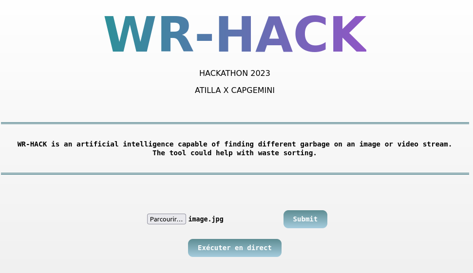
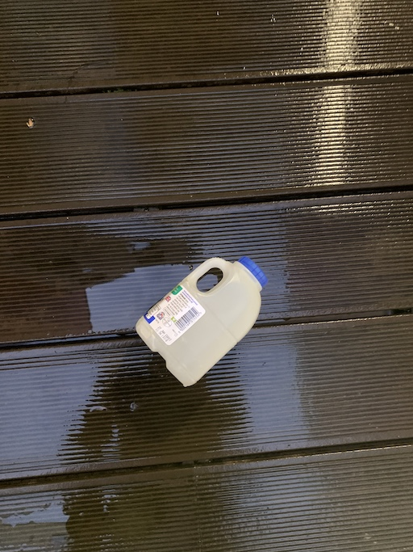
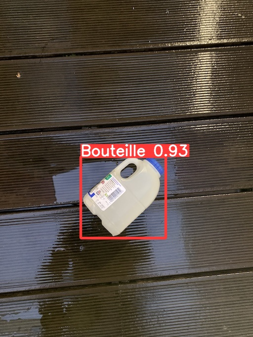

🎯 Introduction: The goal of this project is to create an app that can detect different kinds of trash using deep learning methods, specifically by fine-tuning the YOLOv5 model to our data. This project was developed during a Hackathon organized by Capgemini.

📂 Dataset : The dataset used for training is a trash dataset labeled and provided by the company Neovision.

💻 Installation :
* Clone this repository by using git clone https://github.com/bekkaramohamed/Waste_Recognition_App_Using_Yolov5
* Run pip install -r requirements.txt
* (Only for windows user) : replace command = f'python3 detect.py --weights best.pt --source 0' by command = f' Python.exe detect.py --weights best.pt --source 0' in the app. You should specify the path to Python.exe
* Run python WebAPPCapgmini.py

App Interface :

💡 App functionality :

You can choose to upload a file from the folder 'image_a_detectee', and you will get the output in the file 'image_detectee' :
  

You can choose to run in live streaming with your webcam to detect real time waste

